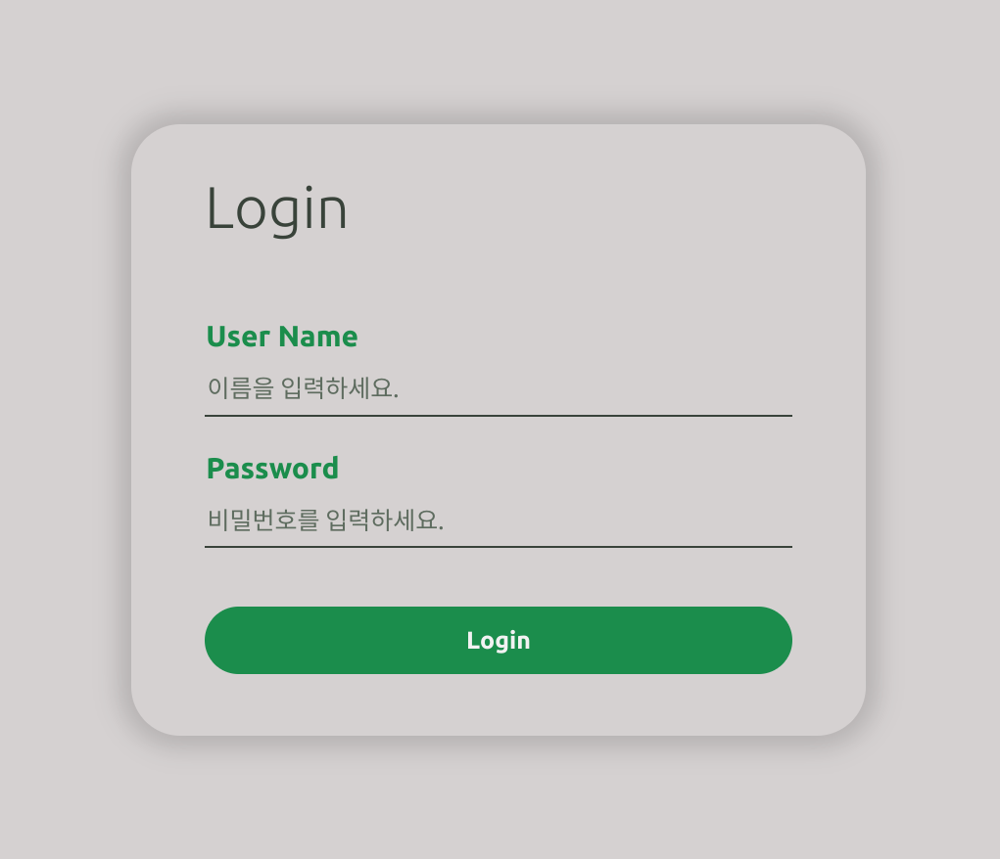
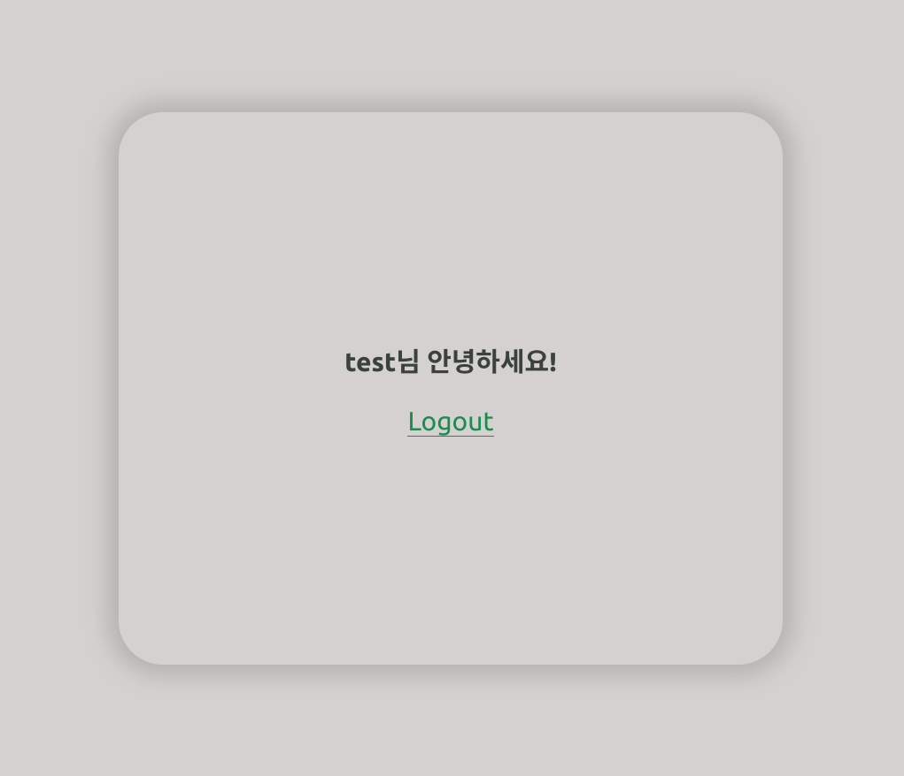
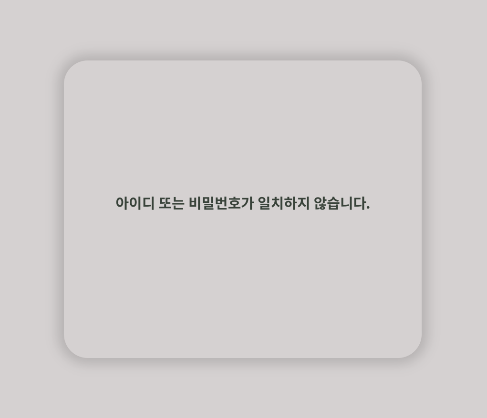
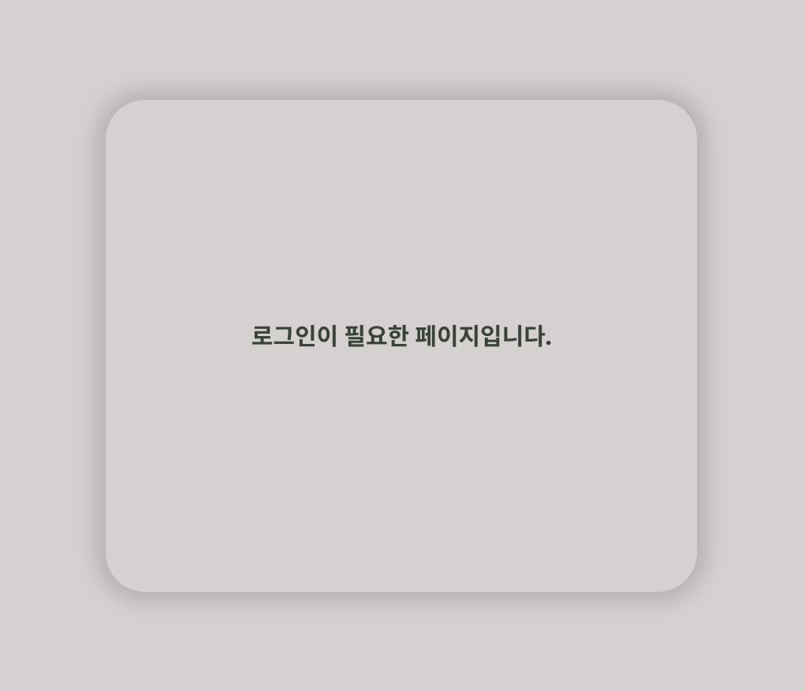

## 설명
- session을 이용한 로그인을 구현해보았습니다.  
- 로그인을 시도하면 mySQL 데이터베이스에 저장된 username과 password를 확인하고, 일치하면 session에 username과 loggedin(Boolean)을 저장합니다.   
- session에 저장된 정보를 이용하여 '/home' 경로에서 로그인 여부에 따라 다른 내용을 보여줍니다.   
- logout 하면 session을 삭제합니다.

## 테스트 방법
mySQL 서버를 열고 아래 명령어를 실행
```mysql
CREATE DATABASE IF NOT EXISTS `nodelogin` DEFAULT CHARACTER SET utf8 COLLATE utf8_general_ci;
USE `nodelogin`;

CREATE TABLE IF NOT EXISTS `accounts` (
  `id` int(11) NOT NULL AUTO_INCREMENT,
  `username` varchar(50) NOT NULL,
  `password` varchar(255) NOT NULL,
  `email` varchar(100) NOT NULL,
  PRIMARY KEY (`id`)
) ENGINE=InnoDB AUTO_INCREMENT=2 DEFAULT CHARSET=utf8;

INSERT INTO `accounts` (`id`, `username`, `password`, `email`) VALUES (1, 'test', 'test', 'test@test.com');
```
로그인폼에 유저네임과 비밀번호를 입력
- user name: test
- password: test


## 미리보기
로그인폼


로그인 성공시 (로그아웃 선택시 로그인폼 화면으로 리다이렉트)


로그인 실패시


로그인 없이 /home으로 진입시


## 참고자료
- [node.js - basic login system](https://codeshack.io/basic-login-system-nodejs-express-mysql/)
- [Docker - MySQL 설치 및 접속하기](https://velog.io/@_nine/Docker-MySQL%EC%84%A4%EC%B9%98-%EB%B0%8F-%EC%A0%91%EC%86%8D%ED%95%98%EA%B8%B0)
- [생활코딩 - 세션과 인증](https://opentutorials.org/course/3400)